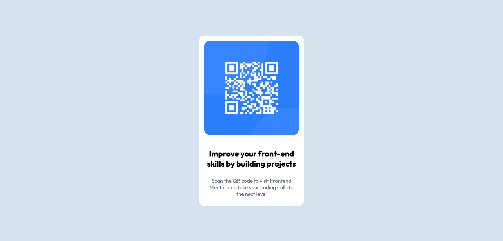

# Frontend Mentor - QR code component solution

This is a solution to the [QR code component challenge on Frontend Mentor](https://www.frontendmentor.io/challenges/qr-code-component-iux_sIO_H). Frontend Mentor challenges help you improve your coding skills by building realistic projects.

## Table of contents

- [Frontend Mentor - QR code component solution](#frontend-mentor---qr-code-component-solution)
  - [Table of contents](#table-of-contents)
  - [Overview](#overview)
    - [Screenshot](#screenshot)
    - [Links](#links)
    - [Built with](#built-with)
    - [What I learned](#what-i-learned)

## Overview

### Screenshot




### Links

- Solution URL: [Github repo](https://github.com/ayeryn/qr-code-component-main)
- Live Site URL: [Github pages](https://ayeryn.github.io/qr-code-component-main/)

### Built with

- Semantic HTML5 markup
- Flexbox
- CSS Grid

### What I learned

- Use flexbox to center /align elements on the page
  - `content-justify`
  - `align-items`
- Align text within an element: `text-align`
- Ensure `<body>` takes up 100% of the viewport:

  ```css
  body {
    margin: 0;
    height: 100vh;
  }
  ```
